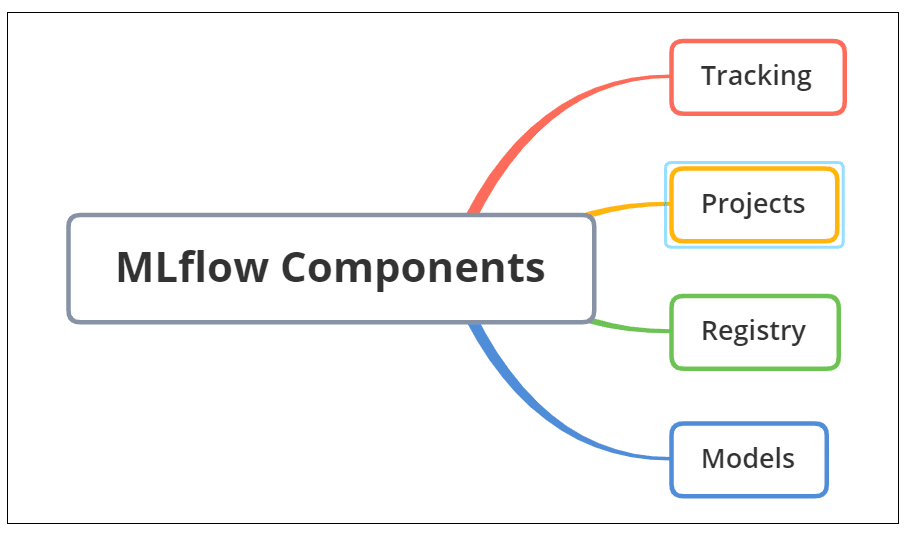
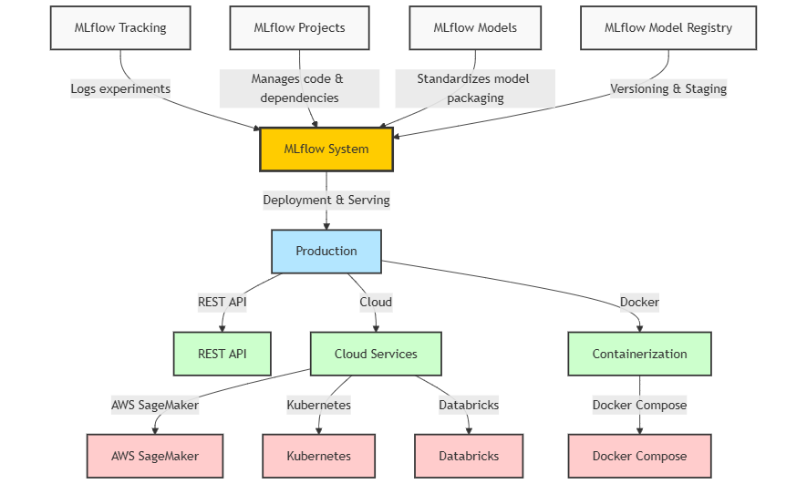
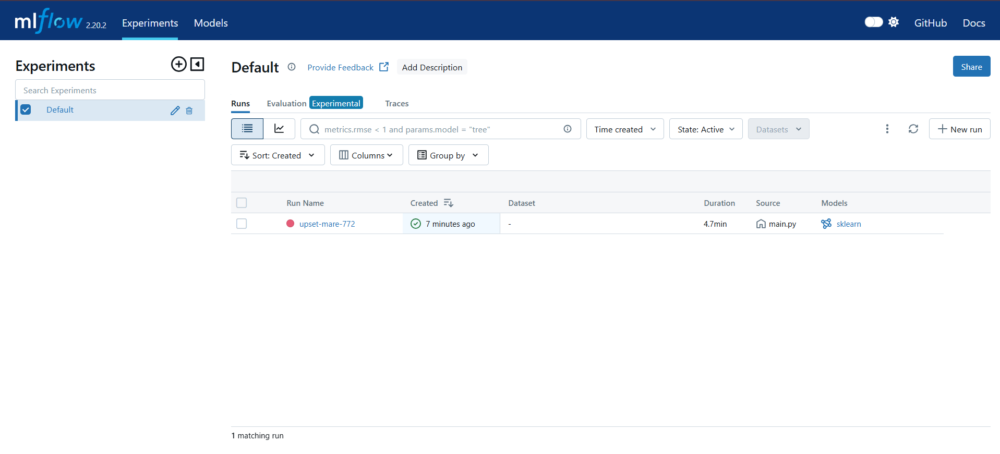

# 🚀 Introduction and Basic Concepts of MLflow

MLflow is an **open-source platform** that streamlines the machine learning (ML) lifecycle by providing tools for **experiment tracking, reproducibility, model deployment, and lifecycle management**.

It helps data scientists and ML engineers **track experiments, manage ML projects, package models, and register models for production** efficiently.

---

## 🔥 Why MLflow?

Unlike traditional software development, ML development is complex because:

✅ **Frequent Experimentation** – Tracking multiple models, hyperparameters, and datasets is necessary.  
✅ **Reproducibility Challenges** – Ensuring results can be recreated consistently is difficult.  
✅ **Deployment Complexity** – Transitioning from research to production involves handling dependencies, formats, and serving strategies.

MLflow solves these challenges by providing a **comprehensive framework** to manage the ML workflow.

---

## 📦 MLflow Components



MLflow consists of **four key components**:

### 🔹 1. MLflow Tracking

📍 Tracks and logs experiments, including parameters, metrics, and artifacts.  
📍 Provides a UI and API for analyzing model performance over multiple runs.

### 🔹 2. MLflow Projects

📍 Defines ML code as a **structured project** with dependencies for easy reproducibility.  
📍 Supports **GitHub, local files, and Docker** for running projects consistently.

### 🔹 3. MLflow Models

📍 **Standardized format** for packaging ML models for different platforms.  
📍 Supports multiple ML frameworks: **Scikit-learn, TensorFlow, PyTorch, Spark ML**, etc.

### 🔹 4. MLflow Model Registry

📍 **Version control** for models, with lifecycle stages like **Staging, Production, and Archive**.  
📍 Stores metadata and allows controlled model transitions.

---

## 📊 MLflow Architecture



## 🛠️ Installing and Running MLflow

### 1️⃣ Install MLflow

Run the following command:

```bash
pip install mlflow
```

### 2️⃣ Verify Installation

Check the installed version:
Run the following command:

```bash
mlflow --version
```

### 3️⃣ Run MLflow UI

To launch the MLflow tracking server, run:

```bash
mlflow ui
```

Once MLflow is running, you can access the MLflow UI at:

🔗 [http://localhost:5000](http://localhost:5000)

The Ui look like this:


Now that MLflow is installed, we can explore its features for tracking, managing, and deploying models.
